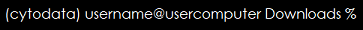

# Intro to Jupyter Notebooks and Jupyter Lab  

This workshop takes you through the following topics with hands on exercises: 

* [Installing and Opening/Closing napari](intro-to-napari-workshop-guide-1-install-napari.md) - 15 minutes  
* [Explore the viewer](intro-to-napari-workshop-guide-2-explore-the-viewer.md) - 15 minutes  
* [Plugins](intro-to-napari-workshop-guide-3-plugins.md) - 15 minutes  
* [Complete a workflow](intro-to-napari-workshop-guide-4-complete-a-workflow.md) - 15 minutes  
* This guide (Jupyter notebooks and Jupyter Lab) - 30 minutes
* [Resources](intro-to-napari-workshop-guide-6-resources.md)

This guide covers the following topics:  
* [Install Jupyter Lab](#install-jupyter-lab)  
* [Create a Jupyter Notebook in Jupyter Lab](#create-a-jupyter-notebook-in-jupyter-lab)  
* [Explore the Viewer with Jupyter Notebooks](#explore-the-viewer-with-jupyter-notebooks)  
* [Run a Notebook with an ML-based Plugin](#run-a-notebook-with-an-ml-based-plugin)   

Jupyter notebooks are scripts for interactive computing in the Jupyter Lab app. They enable working in steps to process data by running code captured in isolated cells. We can use Jupyter Lab to write and execute Jupyter Notebooks written in python in combination with napari to interact with image data. This platform extends the analysis capabilities of napari to allow for additions like batch processing, adjusting layer properties, and ML-based (Machine Learning-based) image processing among other things.  

## Install Jupyter Lab  
* Review these [intro slides](https://github.com/BiAPoL/HIP_Introduction_to_Napari_and_image_processing_with_Python_2022/blob/main/docs/02_Introduction_Jupyter_lab/Introduction_Jupyter_lab.pdf) from Robert Haase.  
* Close your napari window with **File**>**Close Window**.
* In the terminal (Mac) or Anaconda Prompt (Windows), install Jupyter Lab in the conda environment with your napari install as follows:  
    
    * If needed, activate your conda environment first using the following command:  
        ```bash
        conda activate napari-env  
        ```
    * Otherwise, just use: 

        ```bash
        pip install jupyterlab  
        ```

## Create a Jupyter Notebook in Jupyter Lab  

We’ll be reusing the Jupyter Notebooks from the 2022 Scipy Workshop. `(Dannielle - What if they didn't do that workshop?)`  
* Open Jupyter Lab:
    * In the terminal (Mac) or Anaconda Prompt (Windows), enter:  
    `jupyter-lab`    
    * This utilizes your default web browsing app, such as Chrome, to open an instance of Jupyter Lab.  
    * The working directory of this instance of Jupyter lab is the same as the folder you are in in terminal, which is shown on the far right side of the command line.  
         * In the example below, I am in the folder `Downloads`:  
           
         * To change folders in the terminal enter the command:  
         ```bash  
             cd File_Tree
         ```  
        * For example:  
         ```bash  
            cd \Users\username\Downloads  
         ```  

         **Note:** To find the Filetree of a folder or file:  
        * Mac: Open **Finder**, click **View** > **Show Path Bar** > control+left-click the **folder/file name** and click **Copy ‘ ’ as Pathname**  
        * Windows: Open **Search** and copy the **Pathname** in the upper bar. (`Dannielle, is this in File Explorer? I can't figure out where we are when we open Search.`)
    * Open a blank Python3 notebook (see [intro slides](https://github.com/BiAPoL/HIP_Introduction_to_Napari_and_image_processing_with_Python_2022/blob/main/docs/02_Introduction_Jupyter_lab/Introduction_Jupyter_lab.pdf)).

## Explore the Viewer with Jupyter Notebooks  

**Note:** Jupyter Notebooks have the file extension `.ipynb`.

* Navigate to [lesson1 from 2022  SciPy workshop](https://alisterburt.github.io/napari-workshops/notebooks/viewer_intro_scipy.html).  
* Work through the tutorial. 
    * Copy, paste, and run the code blocks with the green left edge where noted.  
    * Experiment with writing your own code in additional cells.  

      **Note:** Use the [Gallery on napari.org](https://napari.org/stable/gallery.html) to get code snippets for your Jupyter Notebook.
* Handy Commands:
    * You can run the notebook document step-by-step (one cell a time) by pressing `shift + enter`.
    * You can run the whole notebook in a single step by clicking on the menu **Cell** -> **Run All**.  
    * To restart the kernel (i.e. the computational engine), click on the menu **Kernel** -> **Restart**. This allows you to start a computation over from scratch (e.g. variables are deleted, open files are closed, etc…). It resets all of the variables that were created in the code so that you can troubleshoot or process new data.  

## Run a Notebook with a ML-based plugin  (machine learning-based plugin)

To install plugins, we recommend:
* Opening **Plugins**>**Install/Uninstall Plugins** in the napari menu
* Waiting for the plugin list to populate
* Searching for the desired plugin in the top search bar
* Clicking the install button  

  **Note:** Some plugins won’t populate their features until napari has been re-opened.  


Read the documentation and install:
(`Dannielle: is this supposed to say stardist-napari-bio-sample-data or stardist-napari, bio-sample-data?`)
* [stardist-napari](https://www.napari-hub.org/plugins/stardist-napari)  
* [bio-sample-data](https://www.napari-hub.org/plugins/napari-bio-sample-data)  
* Navigate to the [Stardist lesson from the 2022 SciPy Workshop](https://alisterburt.github.io/napari-workshops/notebooks/segmenting_and_measuring_nuclei_stardist.html).   
* In Jupyter Lab, start a blank notebook.  
* Work through the tutorial. 
    * Copy, paste, and run code blocks _**with the green left edge**_ where noted.  
    * Follow instructions for running the plugin on the example data.  
* Close Jupyter Lab: In the Jupyter Lab tab, **File**>**Shut Down**.

This is the final guide in the workshop. You can find resources on help, how to ask questions, and other resources in [Resources](intro-to-napari-workshop-guide-6-resources.md).